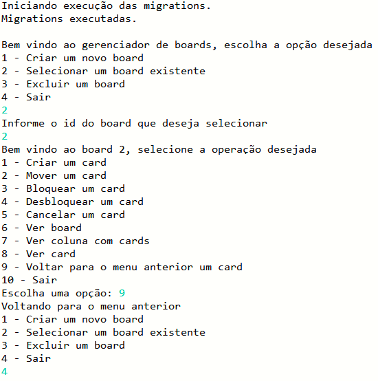
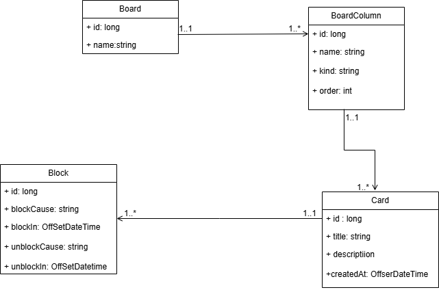

# Criando seu Board de Tarefas com Java

Projeto realizado assistindo as videoaulas do instrutor José Luiz, no bootcamp Bradesco - Java Cloud Native. O projeto original pode ser acessado clicando [aqui](https://github.com/digitalinnovationone/board). 

Foi criado um board de tarefas cujas informações são armazenadas em um banco de dados MySQL. 
Foram realizados os tratamentos de exceções e foi criada uma interface de usuário em que é possível realizar a seleção de opções. 

A figura abaixo mostra a interação com os menus da aplicação via console: 

Abaixo encontra-se o diagrama de classes: 

O projeto foi criado usando o SpringBoot. Abaixo é mostrada a configuração que foi usada: 

### Tecnologias utilizadas 

- SpringBoot
- JavaSE-21
- Banco de dados MySQL
- Biblioteca Liquibase
- Biblioteca Lombok

### Melhorias 

- Foram feitas algumas melhorias nas entradas dos scanners para corrigir alguns erros que estavam aparecendo devido ao uso do **nextInt**. 

- Foram introduzidos dois prints para a visualizar e validar a execução das migrations via console. 

- Foram feitas anotações para melhor entendimento do código.

# 🔎 Links úteis: 

- [Spring Initializr](https://start.spring.io/)
- [Documentação Liquibase](https://docs.liquibase.com/home.html)
- [Download MySQL](https://dev.mysql.com/downloads/mysql/)
- [Biblioteca Lombok](https://projectlombok.org/)