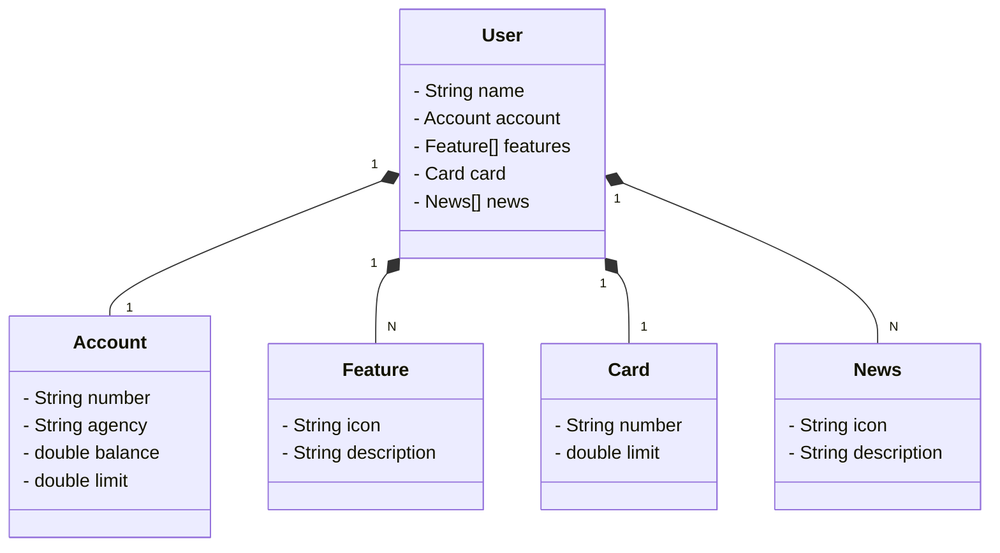

# Bradesco - Java Cloud Native

## Publicando API REST na nuvem usando Spring Boot 3, Java 17 e Railway

Esse projeto foi feito juntamente com o instrutor Venilton. O link para o projeto original pode ser acessao clicando [aqui](https://github.com/falvojr/santander-dev-week-2023). </br>

### JSON utilizado como base para a criação das classes e do banco de dados.

```
{
  "name": "Tiago", 
  "account": {
    "number": "00000000-0",
    "agency" : "0000" ,
    "balance": 1324.24,
    "limit":1000.00
  },
  "features":[
    {
      "icon": "URL",
      "description": "Descrição da Feature"
    }],
  "card": {
    "number": "xxxx xxxx xxxx 0000",
    "limit": 1000.00
  },
  "news": [
    {"icon": "url",
    "description":"Descrição da novidade"
    }
    
  ]
 }
```


### Diagrama de Classes 



Foi incluída a configuração de porta no arquivo **application-dev.yml**. 

```
server:
  port: 1023
```

Mesmo com todas as dependências corretas o Swagger não abria.  

Pelo Eclipse, foi preciso limpar os arquivos de build e recompilar o projeto gradle seguindo os seguintes passos: 

1. Clicar com o botão direito no projeto no **Project Explorer**.

2. Ir em **Gradle** -> **Refresh Gradle Project**.

3. Em seguida clicar em **Project** na barra de menu e apertar em **Clean...**

4. Selecionar o projeto e clicar em OK.


### 🔎 Links úteis: 
- [spring initializr](https://start.spring.io/)
- [JSON Editor Online](https://jsoneditoronline.org/#left=local.wafizu)<br>


